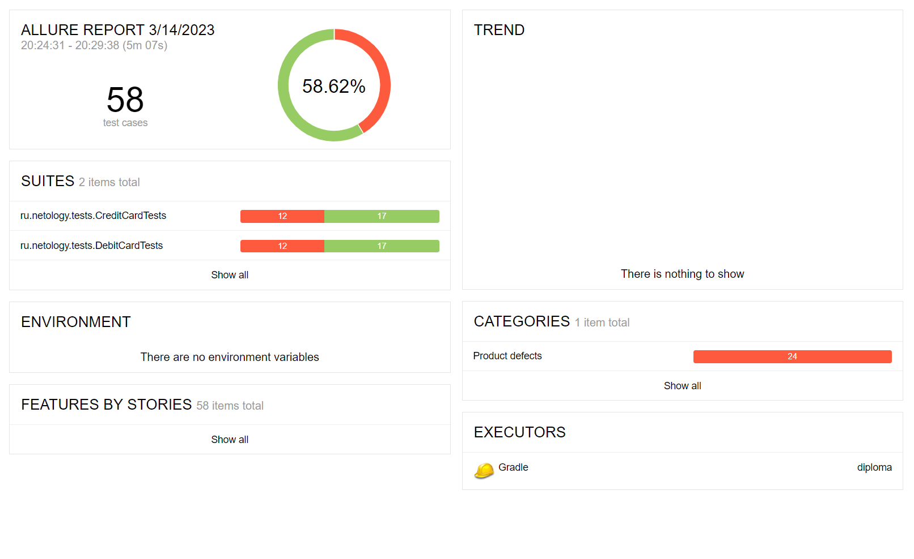

# Отчёт по итогам проведённого тестирования

## Краткое описание

Проведена автоматизация тестирования веб-сервиса для покупки туров согласно согласно [тест-плану](https://github.com/DiKarimo/diploma/blob/main/documents/plan.md).

## Количество тест-кейсов

* Общее количество тест-кейсов – 58;
* Успешные тест-кейсов – 58,6% (34, по 17 на каждую БД);
* Неуспешные тест-кейсов – 41,4% (24, по 12 на каждую БД).

### Allure Report

## Общие рекомендации

1. Устранить найденные [дефекты](https://github.com/DiKarimo/diploma/issues);
2. Доработать front-end:
   * Кнопки «Купить», «Купить в кредит» и «Продолжить» должны подсвечиваться только после выбора. На данный момент кнопки «Купить в кредит» и «Продолжить» подсвечиваются изначально;
   * Добавить подсказку на ограничение количества символов в поле «Владелец»;
   * Доработать визуальное восприятие всплывающих баннеров при удачной и неудачной покупке тура.
